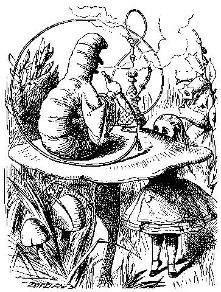

# Magic Square

This puzzle comes from Lewis Carroll.  The magic part is when the
values on a square are arranged so that adding them up in any direction results in
a constant sum.



You have the following values as the input:

```
1.0
1.5
2.0
2.5
3.0
3.5
4.0
4.5
5.0
```

You need to arrange them in a 3 x 3 matrix so that:

1. The sums of numbers in each row = magic number
2. The sums of numbers in each column = magic number
3. The sums of numbers in each diagonal = magic number

## Lang
- Java